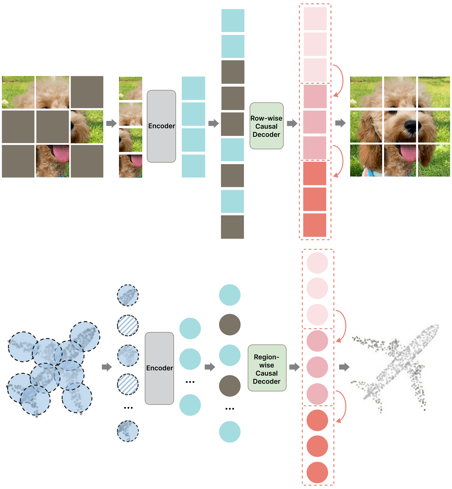

# MAP: Unleashing Hybrid Mamba-Transformer Vision Backbone's Potential with Masked Autoregressive Pretraining

**Official PyTorch implementation of MAP: Unleashing Hybrid Mamba-Transformer Vision Backbone's Potential with Masked Autoregressive Pretraining**

- **Accepted by CVPR2025**
- **Arxiv:** [https://arxiv.org/pdf/2410.00871](https://arxiv.org/pdf/2410.00871)

---




## Models

|    Model    |                         Pretrained Checkpoint                         |
|:-----------:|:---------------------------------------------------------------------:|
| **MAP-Tiny** | [map_tiny_patch16_224](https://1drv.ms/u/c/12e5c3dbeffd0594/EQ94MObzMttJr9Gsx64Iz_EBrlnLpvkOj1zkaMC3KfxmUg?e=BK5TZ3) |
| **MAP-Small** | [map_small_patch16_224](https://1drv.ms/u/c/12e5c3dbeffd0594/ERB_CVQtfeFFtszIZ4z2-MwBjckx6Q5xJql_kbQd6AKJBA?e=BargaK) |
| **MAP-Base**  | [map_base_patch16_224](https://1drv.ms/u/c/12e5c3dbeffd0594/EfcSBplUe45Akije_5rsM90Bv7VkMneliUP1sVIAJvNWwA?e=JLLe0f)  |
<!-- | **MAP-Large** | [map_large_patch16_224]() |
| **MAP-Huge** | [map_huge_patch16_224]() |

*We also provide a 600 epoch MAP-huge. -->
## Environments

```bash
# torch>=2.0, cuda>=11.8
pip install timm==0.4.12 mlflow==2.9.1
pip install causal-conv1d==1.1.0
pip install mamba-ssm==1.1.1
```

## Training

```bash
python -m torch.distributed.launch --nproc_per_node=8 --use_env main.py \
    --model mambar_tiny_patch16_224 --batch 1024 \
    --lr 5e-4 --weight-decay 0.05 \
    --data-path in1k --output_dir ./output \
    --epochs 1600 --input-size 224
```
*For downstream fine-tuning, we strictly follow other baselines to ensure fair comparisons. For the Mamba-based framework, please refer to [Mamba-r](https://github.com/wangf3014/Mamba-Reg), and for the Transformer-based framework, please refer to [MAE](https://github.com/facebookresearch/mae).


## PointMAP：MAP for 3D Task
The code for 3D tasks is mostly derived from [Mamba3D](https://github.com/xhanxu/Mamba3D), so you should first follow the Mamba3D instructions to set up the environment and run its training code.

We have open-sourced the key files for the MAP model implementation and pretraining. You can directly copy them into the `Mamba3D/models` directory to support the MAP framework and MAP pretraining.


## TODO
- [ ] Release MAP applications in point cloud video/robotics
- [ ] Release the VideoMAP code
- [ ] Release the VideoMAP paper
- [ ] Release the weights of MAP-Large and MAP-Huge
- [x] Release the model and pretrain code for 3D Task
- [x] Release MAP training code and weights
- [x] Release the [MAP](https://arxiv.org/pdf/2410.00871) paper
## Acknowledge
We thank the work of [MAE](https://github.com/facebookresearch/mae), [Mamba-r](https://github.com/wangf3014/Mamba-Reg), [MambaVision](https://github.com/NVlabs/MambaVision), [ARM](https://github.com/OliverRensu/ARM) and [Mamba3D](https://github.com/xhanxu/Mamba3D) for their contributions to the field and for inspiring us to propose this project.


## Citation

```bibtex
@article{liu2024map,
  title={MAP: Unleashing Hybrid Mamba-Transformer Vision Backbone's Potential with Masked Autoregressive Pretraining},
  author={Liu, Yunze and Yi, Li},
  journal={arXiv preprint arXiv:2410.00871},
  year={2024}
}
```


